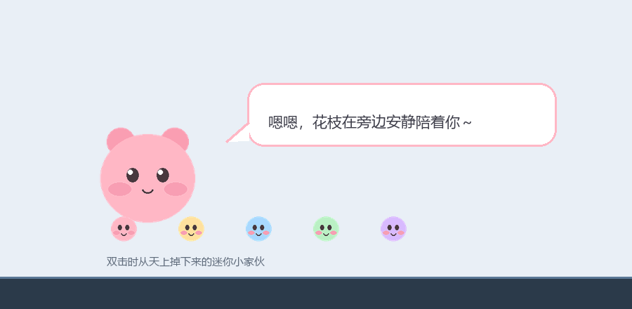
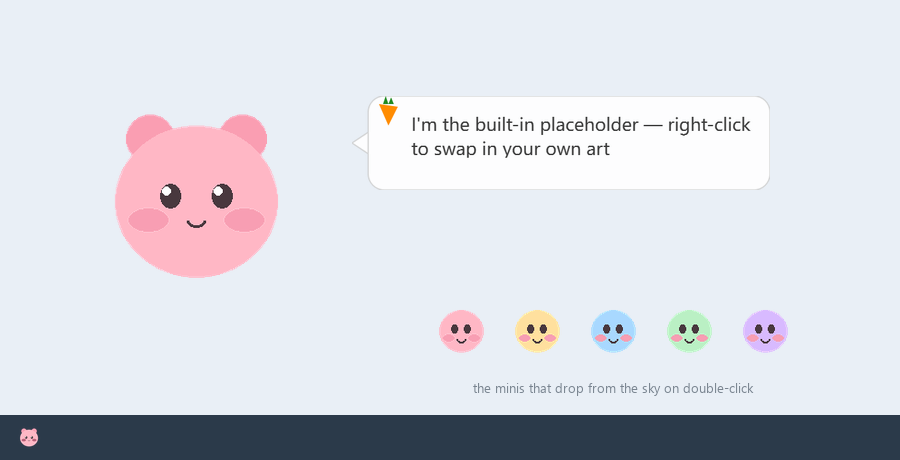

# Desktop Pet

A transparent desktop companion that lives on your screen — it chats, naps, keeps you company while you type, and looks up words for you.

> 中文版：[README.md](README.md)



> The screenshot shows the **author's own artwork** (the source PNGs aren't redistributed). The repo also ships placeholder sprites so it runs right after cloning — see [Bring your own sprites](#bring-your-own-sprites).

---

## Download

Don't want to set up an environment? Grab the packaged build from the releases page:

👉 **[Releases · v6.9](https://github.com/owdeky017-ui/desktop-pet/releases/tag/v6.9)**

The release ships two independent builds, **each fully in its own language — menus, settings, and the pet's dialogue**:

| Build | Archive | Executable | UI language | Guide inside |
| --- | --- | --- | --- | --- |
| Chinese | `DesktopPet-v69-windows.zip` | `DesktopPet_v69.exe` | Chinese | `使用说明.txt` |
| English | `DesktopPet-v69-windows-en.zip` | `DesktopPet_v69_en.exe` | English | `Instructions.txt` |

Unzip everything into one folder and double-click the executable for the build you want. No installer. Both builds can live in the same folder without interfering with each other.

Besides the executable and the guide, the zip contains 6 placeholder sprites:

| File | What it is |
| --- | --- |
| `pet_transparent.png`<br>`mini_1.png` ~ `mini_5.png` | Default placeholder sprites — edit these to reskin the pet, then put them back next to the exe. |

> **Heads up: what you get is not what you see in the screenshot above.** The screenshot is a finished illustration of the author's own art (for show only); the release ships a placeholder sprite (a pink bear). To swap in the author's art or your own, see the guide inside the zip.

---

## Features

- **Transparent, frameless window** — truly lives on your desktop without taking up taskbar space.
- **Rich interactions** — single click, double click, long press, hover petting, scroll-zoom, and drag to move.
- **Animates on its own** — walks, stretches, yawns, and looks around; naps when ignored for a while.
- **Clings to windows** — drag it onto a window edge and it snaps on with a tilted pose.
- **Typing companion & live translation** — listens to your keyboard and reacts to your pace; auto-translates English you copy to the clipboard.
- **Word lookup & vocab book** — right-click to look up a word; saved to a personal vocab book exportable as editable HTML.
- **Screenshot tool** — full-screen or region capture, with save / copy choices.
- **System tray** — show/hide, settings, autostart, exit.
- **Customizable dialogue** — edit lines in a JSON file, with an in-app visual editor.

---

## Quick start

Requires Python 3.10+ on Windows (the app uses Win32 APIs for the keyboard hook, autostart registry, and window enumeration).

```bash
# Clone the repo
git clone https://github.com/owdeky017-ui/desktop-pet.git
cd desktop-pet

# Create a virtual environment
python -m venv venv
venv\Scripts\activate

# Install dependencies
pip install -r requirements.txt

# Run it
python main.py
```

### Build the exe

```bash
pip install pyinstaller
pyinstaller --noconfirm --onefile --windowed --name DesktopPet_v69 ^
  --add-data "placeholder\pet_transparent.png;." ^
  --add-data "placeholder\mini_1.png;." ^
  --add-data "placeholder\mini_2.png;." ^
  --add-data "placeholder\mini_3.png;." ^
  --add-data "placeholder\mini_4.png;." ^
  --add-data "placeholder\mini_5.png;." ^
  main.py
```

> **Don't skip `--add-data`.** Without the sprites bundled, the app still launches but renders nothing — `QPixmap` fails silently and returns a null pixmap, which looks exactly like a successful build. Use `;` as the separator on Windows, `:` on macOS/Linux.

To embed your own art, swap `placeholder\` for your own paths (see below). The resulting `DesktopPet_v69.exe` runs standalone with the sprites embedded. If you want users to be able to swap sprites, ship the PNGs alongside it in the zip — see below.

### Build the English version

The UI language is decided by a **`lang.txt` bundled at build time** — it is not a runtime toggle. Put `en` in it and you get the English build; without the file (or with `zh`) you get the Chinese one.

```bash
# Prepare the language marker
mkdir build_lang_en
echo en > build_lang_en\lang.txt

# Build the English exe: one extra --add-data drops lang.txt into the bundle root
pyinstaller --noconfirm --onefile --windowed --name DesktopPet_v69_en ^
  --add-data "build_lang_en\lang.txt;." ^
  --add-data "placeholder\pet_transparent.png;." ^
  ...(the other 5 minis go here)...
  main.py
```

> The file must be named `lang.txt` — `--add-data` places files in a target directory without renaming them, so prepare the Chinese and English markers in separate folders.

> **The dialogue library is split by language**: the Chinese build writes `data/lines.json`, the English build writes `data/lines_en.json`. The two builds are very likely to be unzipped into the same folder and share `data/`; a single shared file would mean whichever build runs first forces its language on the other (the English build would start speaking Chinese). On first launch the English build also adopts a legacy `lines.json` if its content really is English (it shares lines with the defaults), so no user-edited dialogue is lost.

Under the hood every UI string is written as `T("中文原文")`. `T()` returns the string unchanged in the Chinese build and looks it up in the `EN` table in the English one. The dialogue library, menus, settings window, bubbles, and the word-list export page all go through it. **The Chinese build's output is byte-for-byte identical to before i18n was added.**

---

## Bring your own sprites

The repo ships with **generated placeholder sprites** (`placeholder/`) so it runs right after cloning:



```bash
copy placeholder\*.png .
python main.py
```

When you're ready to swap in your own art, drop these files into the repo root (or the directory next to the exe):

| File | Used for |
| --- | --- |
| `pet_transparent.png` | Main sprite **and** system tray icon — the tray reuses this same file. Use a transparent background. |
| `mini_1.png` ~ `mini_5.png` | Mini characters that drop from the sky on double-click. |

> `pet.png` is never referenced — the tray loads `pet_transparent.png` via `QIcon(PET_IMAGE)`.

Optionally add more skins by naming them `pet_<name>.png`. Switch between them in the right-click menu → Settings → Skin.

---

## Where data lives

Runtime files (vocab, dialogue library, logs, screenshots) live in a **`data/` folder next to the program**. Window position, scale, and toggles are written to **`pet_config.json` next to the exe** — kept outside `data/` so it's easy to find and edit.

```
DesktopPet_v69.exe
├── pet_config.json    # window position, scale, toggles (kept beside the exe for easy editing)
├── (your PNGs)        # pet_transparent.png / mini_*.png / pet_xxx.png
└── data/
    ├── vocab.json          # vocab book
    ├── lines.json          # custom dialogue (Chinese build; generated on first run)
    ├── lines_en.json       # custom dialogue (English build; same idea)
    ├── typing_log.txt      # debug log (generated as needed)
    ├── translation_log.txt # debug log (generated as needed)
    └── screenshots/        # screenshots folder
```

### Rename your pet

Dialogue lines contain a `{name}` placeholder that resolves at runtime from `pet_name` in `pet_config.json` — **unnamed by default**, in which case the pet refers to itself as 我 (the Chinese word for "I"). Two ways to rename:

**1. Through the UI (recommended)** — right-click the pet → Settings → type a new name in the box → OK. Takes effect immediately; the tray tooltip and dialogue update live.

**2. Edit the config directly** — open `pet_config.json` and change `"pet_name"`:

```json
{ "pet_name": "小豆丁" }
```

> Leaving the box empty makes the pet refer to itself as 我 (the `{name}` placeholder resolves to 我).

---

## Autostart on login

Right-click → Autostart writes a `DesktopPet_Pet` entry under `HKCU\Software\Microsoft\Windows\CurrentVersion\Run`.

> Older builds (early v6.9) used `DesktopPet_Hana`. Writing the new value also deletes the old one, so you never end up with two autostart entries launching the app twice.

---

## System tray

The pet window is **hidden on startup by default** — only the tray icon shows, so it won't take over your desktop the moment you launch it. Two ways to bring it out:

- Click the tray icon.
- Right-click the tray icon → Show/hide pet.

To change it: right-click → Settings → uncheck **"Hide window on startup (tray only)"** (Chinese build: 「启动时隐藏窗口（只在托盘显示）」) → OK. The pet window will show on launch from then on.

> **Tray icon missing?** Windows folds infrequently used icons into the "hidden icons" overflow (the up arrow). Click the arrow to find it; to pin it: **Settings → Personalization → Taskbar → Taskbar corner overflow** → turn Desktop Pet on. That's a Windows-level setting the app can't set for you.

---

## Project layout

```
.
├── main.py              # all the code (transparent window, animation, bubbles, vocab book, screenshots, translation, ...)
├── requirements.txt     # dependencies
├── .gitignore           # excludes venv / .exe / root-level real sprites / runtime data dir
├── placeholder/         # placeholder sprites (generated; copy to root to run after cloning)
├── docs/preview.png     # screenshot at the top of the README
├── pet_config.json      # sample config (overwritten with your own at runtime)
├── vocab.json           # vocab book (starts empty)
├── 生词本.html          # sample vocab-book export (demo only, no real data)
├── README.md            # Chinese README
├── README_EN.md         # this file
├── 使用说明.txt         # guide shipped in the Chinese build
└── Instructions.txt     # guide shipped in the English build
```

---

## Known limits

- Windows only — the keyboard hook, autostart registry, and window enumeration are all Win32-specific.
- Fullscreen-exclusive games will cover the pet; there's no way to draw on top of a DirectX surface.
- Translation uses the free MyMemory API and will fail once you pass the daily quota.

---

## License

MIT — see [LICENSE](LICENSE).
